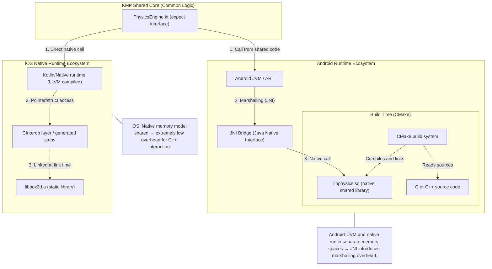

# 🪐 ThreeBodySimulation  
### Kotlin Multiplatform • C++ • JNI • CInterop • Box2D Physics Engine

<div align="center">


<br>

**“Write Once, Simulate Everywhere.”**  
<i>A hybrid KMP architecture integrating the Box2D C++ physics engine into Android (JNI) and iOS (CInterop) with high performance.</i>

</div>

---
---

## 1. Overview

**ThreeBodySimulation** demonstrates how a high-performance **C++ physics engine (Box2D)** can be integrated into a modern **Kotlin Multiplatform (KMP)** codebase while preserving platform abstraction.

This project is a **Proof of Concept (PoC)** designed to answer a core systems-engineering question:


https://github.com/user-attachments/assets/c60cd637-db49-473d-ab98-f0d98d16638a


> **How can native C++ physics code be reused across Android and iOS while maintaining a single shared API in Kotlin?**

### Core Idea
- One shared API (`PhysicsEngine`) defined in `commonMain`.
- Two platform-specific implementations:
  - **Android → JNI → C++**
  - **iOS → Kotlin/Native → CInterop → C++**

The result is a clean architecture that hides cross-platform native complexity behind a unified Kotlin abstraction.

---

## 2. Architecture & Execution Flow

This system relies on **fundamental differences** in memory models and native execution between Android and iOS:

- **Android** uses a managed VM (ART) → JNI → native `.so` library.
- **iOS** uses true native execution → static linking of `.a` libraries → zero marshalling overhead.

Below is the complete data and execution flow:



### What This Architecture Demonstrates

1. **Cross-platform Native Abstraction**  
   Both platforms implement the same shared interface, allowing UI layers to ignore platform-specific details.

2. **Two Native Integration Models**  
   - Android uses **JNI** (managed → unmanaged transition).
   - iOS uses **CInterop** (native → native transition).

3. **Isolated C++ Core**  
   Box2D exists independently of platform UI frameworks (Compose or SwiftUI).

---

## 3. Platform Differences (Technical Summary)

| Feature | Android | iOS |
|--------|---------|-----|
| Native Bridge | JNI | CInterop |
| C++ Input | Raw `.cpp` sources | Precompiled static `.a` |
| Build System | CMake + NDK | Xcode link-time integration |
| Memory Model | VM with GC + marshalling | Native memory with direct access |
| Performance Cost | Higher boundary overhead | Near-zero boundary overhead |

---

## 4. Project Structure

### 4.1 Shared Logic (`commonMain`)
Location:  
```
composeApp/src/commonMain/kotlin/com/hsntncy/...
```

Contains:
- **`ThreeBodyEngine.kt`** — `expect` interface defining required physics operations.  
- **`SimulationModels.kt`** — data models for celestial bodies (planets, stars, vectors).

---

### 4.2 Android Implementation (`androidMain`)
Location:  
```
composeApp/src/androidMain/
```

Key native files:
- **`cpp/box2d_source/`** — raw Box2D C++ source code.
- **`cpp/native-lib.cpp`** — JNI bridge mapping Kotlin calls to C++.
- **`cpp/CMakeLists.txt`** — build script for generating `libphysics.so`.

---

### 4.3 iOS Implementation (`nativeInterop` & `iosApp`)
Location:  
```
composeApp/src/nativeInterop/cinterop/
```

Contains:
- **`box2d.def`** — describes headers and static library to Kotlin/Native.  
- **`include/box2d/`** — Box2D headers.  
- **`lib/`** — `libbox2d.a` static library.

App entry point:
- **`iosApp/iOSApp.swift`** (SwiftUI)

---

## 5. Setup & Running the Project

### Requirements
- Android Studio Ladybug or newer  
- Xcode 15+  
- JDK 17+  
- Kotlin Multiplatform plugin enabled  

---

### Android Setup

```bash
git clone https://github.com/Hasan-Tuncay/ThreeBodySimulation.git
cd ThreeBodySimulation
```

1. Open project in Android Studio  
2. Wait for Gradle sync  
3. CMake will automatically compile C++ sources  
4. Run the `composeApp` configuration  

---

### iOS Setup

```bash
./gradlew podInstall
```

1. Open `iosApp.xcodeproj`  
2. Select simulator  
3. Press Run  


## 6. Technologies Used

- **Languages:** Kotlin, C++, Swift  
- **UI:** Jetpack Compose Multiplatform, SwiftUI  
- **Physics Engine:** Box2D (C++)  
- **Native Bridges:** JNI (Android), CInterop (iOS)  
- **Build Systems:** Gradle (Kotlin DSL), CMake, Xcode  
- **Architecture Pattern:** Clean Architecture, MVI  

---

<div align="center">

### Developer  
**[HASAN TUNCAY]**  
[[LinkedIn](https://www.linkedin.com/in/hasantuncay2635/)](#)

</div>
